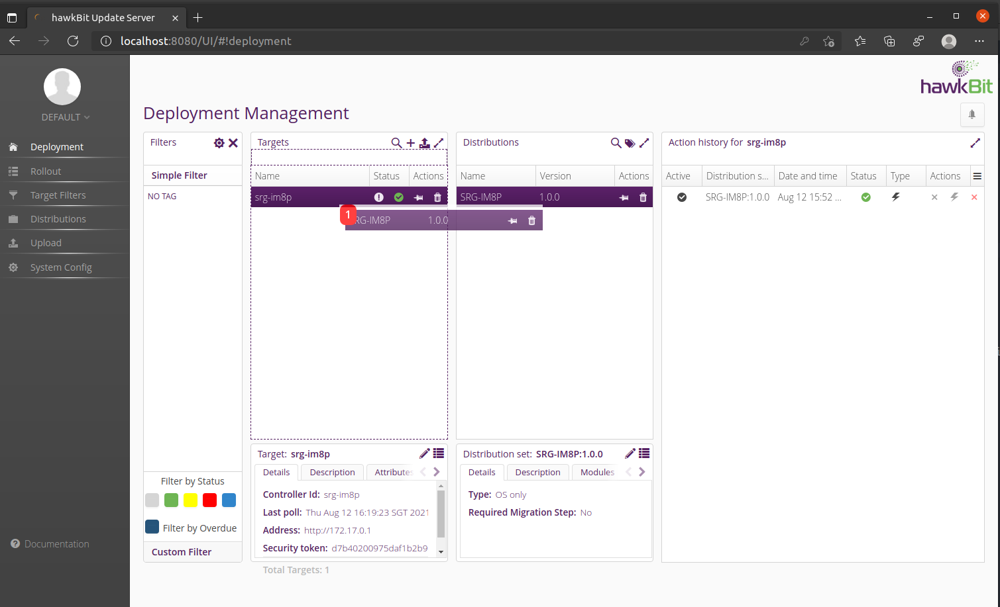

Offline and On-The-Air Update
===

### Offline automatic update with USB disk
1. prepare USB disk for update, need copy **'srg-im8p-update-srg-im8p.swu'** into an USB Disk(VFAT)
2. on device run the below command for check update process
```
journalctl -xfu swupdate
```
3. connection USB disk on device, check device message

OTA with Hawkbit update server
===
### setup and launch Hawkbit update server

pull latest docker image
```
docker pull hawkbit/hawkbit-update-server
```

start hawkbit server
```
docker run -p 8080:8080 hawkbit/hawkbit-update-server:latest \
  --hawkbit.dmf.rabbitmq.enabled=false \
  --hawkbit.server.ddi.security.authentication.anonymous.enabled=true

```

### configure update task

create an update task on Hawkbit server.

1. open web browser to visit "<your host>:8080" and login by **admin** with password **admin**


2. enable the option ***'Allow targets to download artifacts without security credentials'*** of **System Config** tab


3. create new ***Distribution*** in **Distributions** tab


4. create new ***Software Module*** in **Distributions** tab


5. upload ***swu-image-update-srg-im8p.swu*** to server in **Upload** tab


6. to dragging distribution to target device for enable update task



7. complete update action


modify tips for Swupdate
===

### config & RSA key pair files
Swupdate will use the below file to check hardware compatibility and software version on device

* /etc/swupdate-hw-compat
* /etc/sw-versions

use the follow file for update package verify and another config

* /etc/swupdate/public.pem
* /etc/swupdate/swupdate.cfg

detail information in **'${BSP_DIR}/recipes-support/swupdate'**

### update package

detail information in **'${BSP_DIR}/recipes-srg-im8p/image/srg-im8p-update.bb'**

### disk layout

check **'${BSP_DIR}/wic/srg-im8p-image.wks.in'**

### References:
1. [SWUpdate](https://sbabic.github.io/swupdate/), update software for embedded system
2. [Eclipse Hawkbit](https://www.eclipse.org/hawkbit/), Over-The-Air update Server
3. [Building a Linux system for the STM32MP1: remote firmware updates](https://bootlin.com/blog/building-a-linux-system-for-the-stm32mp1-remote-firmware-updates/)
